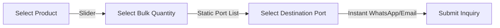

# 💎 The Diamond User Experience (UX) Standard
## HeviNet.in — Frictionless, Intuitive, and Immersive B2B Navigation

This document defines the **Diamond UX Standard** for the HeviNet repository. While the Design Standard specifies how the site looks, this UX Standard specifies how the site *feels, behaves, and converts*.

---

## 📈 1. Frictionless B2B Inquiry Flow (Phase 1)
Standard forms cause high checkout abandonment. The Diamond Standard uses a streamlined, static-backed Inquiry Wizard designed for B2B buyers who prioritize fast communication.

### 1.1 Tactile Quantity Sliders
*   Instead of typing numeric fields, buyers use a tactile sliding scale that snaps to standard trade packaging limits (e.g., *100kg*, *500kg*, *1 Ton*, *5 Tons*).
*   **Static Tiers:** Displays pre-configured static bulk discount tiers alongside the slider (e.g., "Tier 1: 500kg - 1 Ton: Contact for wholesale pricing") to prevent the need for a complex pricing engine API.

### 1.2 Static Port Selector
*   Includes a dropdown populated with major target ports (e.g., *Port of Singapore*, *Port Klang*, *Jebel Ali*).
*   **Static transit disclaimers:** Display static transit duration ranges (e.g., "Transit to Jebel Ali: approx. 7-10 business days") to set shipping expectations immediately.

### 1.3 Communication Focus
*   The wizard submits the details directly via **WhatsApp link triggers** or a clean email fallback. B2B buyers in global markets strongly prefer direct, conversational negotiation.

---

## 🔍 2. Predictive Search & Nav Mechanics

### 2.1 Global Search Command Center (`Ctrl + K`)
*   Pressing `Ctrl + K` or `Cmd + K` opens a blurred search modal overlay.
*   **Fuzzy Autocomplete:** Searches not just titles, but product tags, origins, and category matches.
*   **Focus Capture:** The search triggers focus lock and trapping. Focus returns to the search button when the modal is closed, conforming to accessibility standards.

### 2.2 Category Navigation
*   Use the mega menu in the main navigation.
*   Category tabs on the products catalog page filter items instantly using client-side route queries without triggering full-page layout re-renders.
